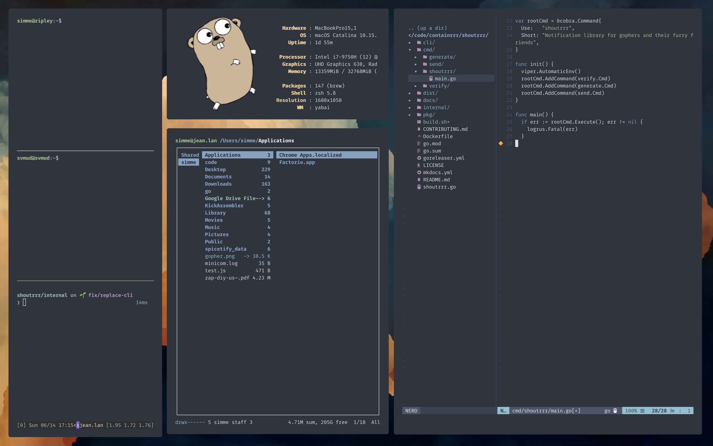

---

A collection of bits and pieces I've written or found over the years. Takes a computer from an empty shell to a fully setup macOS environment in about 20 minutes. Just run `install.sh`, no prior setup required.

