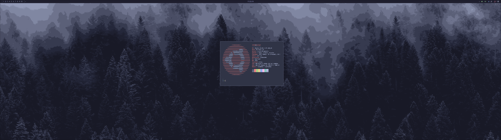
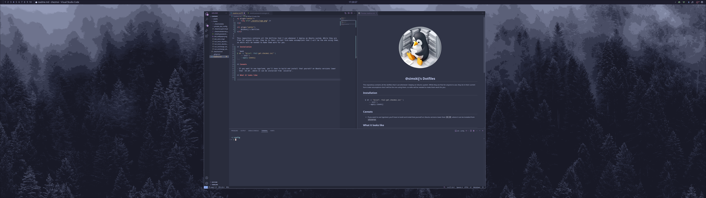
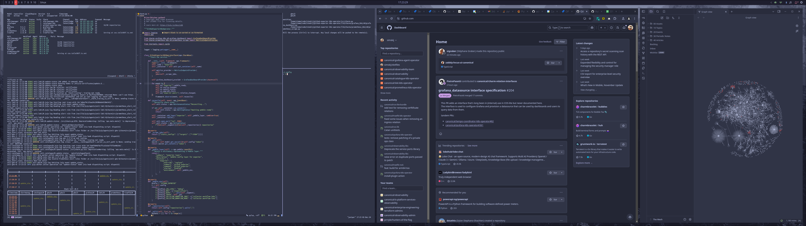

<p align="center">
    
</p>

<h1 align="center">
    @simskij's Dotfiles
</h1>


This repository contains all the dotfiles that I use whenever I deploy an Ubuntu system. While they are free for anyone to use, they do in their current form make assumptions that I will be the one using them, so edits will be needed to make them work for you.

## Installation

```bash
$ sh -c "$(curl -fsLS get.chezmoi.io)" \
    -- init \
    --apply simskij
```

## Caveats

- If you want to use hyprland, you'll have to build and install that yourself on Ubuntu versions lower
  than `24.10`, where it can be installed from `universe`.

## What it looks like





